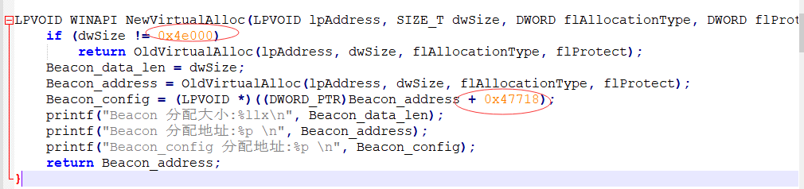
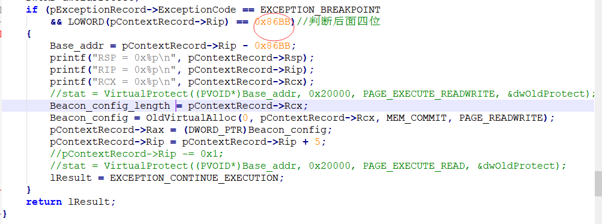

# bypass BeaconEye

## Hook_Sleep1

只适配了4.3的默认profile，作为demo测试食用，修改配置文件过后

这两处可能需要更改，自行调试

## Hook_Sleep2

使用方式: 生成payload.bin -> deal.py处理成result.bin -> 重命名result.bin为payload.bin

使用int3 断点来patch的，通过deal.py将payload.bin的malloc函数的一个字节替换为0xCC，主动造成异常，捕获，然后修改成自己的VirtualAlloc，可适配多个类型

出错可自行调试，只作为demo代码使用

